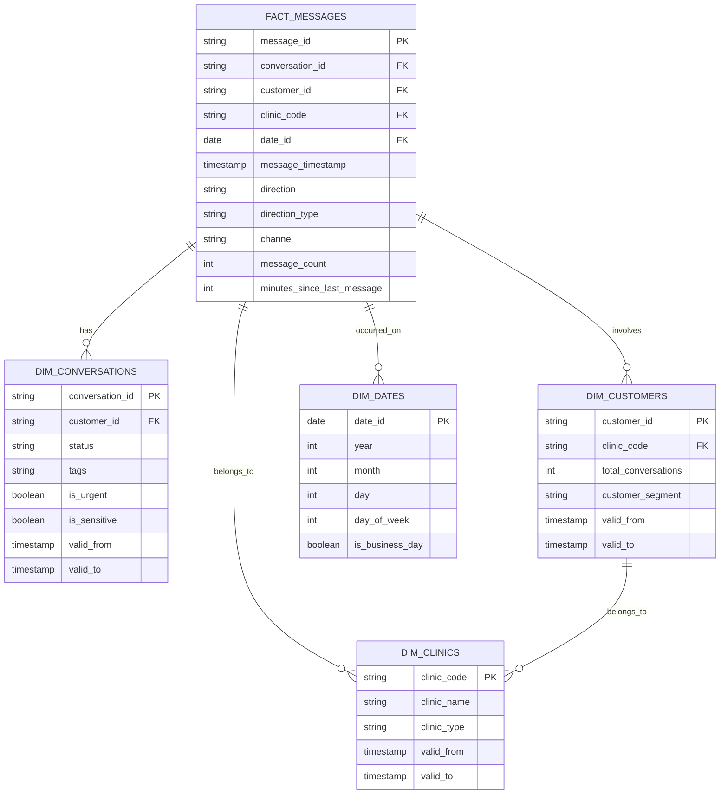

# GetHarley Data Warehouse

A star schema data warehouse implemented using dbt and Snowflake to analyze customer conversations and messaging patterns. The warehouse features incremental loading for fact tables and SCD Type 2 for tracking dimensional changes, enabling comprehensive analysis of customer interactions and clinic performance.

## Business Problems Solved

### 1. Response Time Analysis
Track and optimize clinic response times to customer messages, analyzing patterns by clinic, time of day, and message type.

### 2. Customer Engagement Tracking
Monitor customer interaction patterns, conversation frequencies, and engagement levels across different clinics and time periods.

### 3. Conversation Theme Analysis
Analyze common conversation topics and urgent issues using conversation tags, helping identify trending concerns and areas needing attention.

### 4. Clinic Performance Monitoring
Compare clinic performance metrics including response times, conversation volumes, and customer satisfaction indicators.

### 5. Historical Trend Analysis
Track changes in conversation patterns and clinic performance over time using SCD Type 2 tracking in dimension tables.

## Data Model

